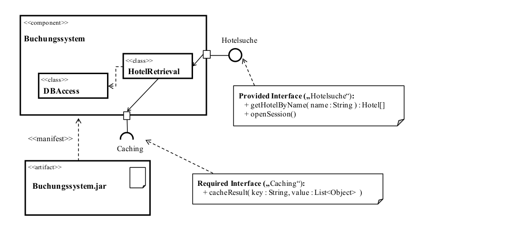
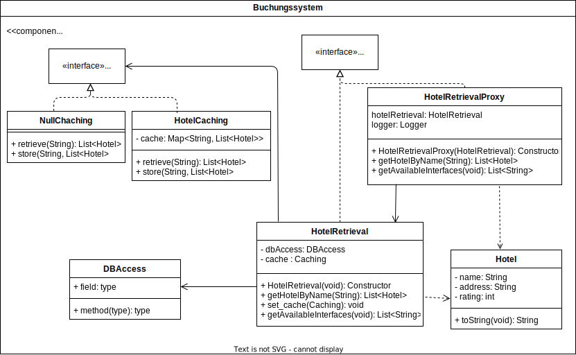

# OOKA - Proxy Pattern

## Tasks:

Given the following Model, implement a port concept:

1. Port Concept implemented via Proxy Pattern.
- Hotelsuche-Interface
- HotelRetrieval-Class
- HotelRetrievalProxy-Class

1. Created a Hotel-Class
2. Added Caching interface and Class
3. Added default Caching class which returns Null
    - HotelRetrieval has to check if the return value is `null`.
4. Added Logging functionality to Proxy-Class
5. Created executable .jar file
    - Included dependencies (postgresql) via maven-shade-plugin into the same jar-file.
6. Included get_interfaces()-Method: Prints available methods.

## Class diagram

## Open questions

- Caching is not implemented as an external component yet. Instead inside the component itself.
    -> Cache just has to be plugable from proxy. Than its considered as a seperate component!
- Dont know yet how to access the .jar-files interfaces. (Currently just printing the available interfaces via main-method.)
    -> All public classes are currently available from outside and can be accessed.
- The port/interface is an internal part of the component. Not sure if this is the desired solution.
- When to use maven-shade vs assembly?
- Lassen sich alle public classes/interfaces als externe Schnittstelle darstellen?

## Resources

- [Proxy Pattern](https://refactoring.guru/design-patterns/proxy#:~:text=Proxy%20is%20a%20structural%20design,through%20to%20the%20original%20object.)
- [Maven-Jar File Creation](https://www.baeldung.com/executable-jar-with-maven)
- [Maven-Shade Plugin for dependency integration](https://maven.apache.org/plugins/maven-shade-plugin/examples/executable-jar.html)
- [Adding mainClass in pom for compiler](https://stackoverflow.com/questions/29920434/maven-adding-mainclass-in-pom-xml-with-the-right-folder-path)