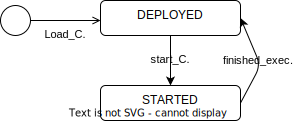

# OOKA - Java Runtime Environment

## Task 2 answers

### Create a UML-based state diagram for the application.

### Test ClassLoading mechanism via JUnit.

- Tests inside [LZU-Tests](../Runtime_Env/src/test/java/org/ooka/lzu/RuntimeEnvironmentTest.java).

### Which criteria of the classification framework bz Crnkovic are meet by the Component-Model ?

#### **Lifecycle**

| Modelling | Implementation | Packaging | Deployment |
|--|--|--|--|
| N/A | Java | Packages, JARs | At run-time |

#### **Construction**

| Exogenous (Binding)| Vertical (Binding)| Interaction Styles | Communication Type |
|--|--|--|--|
| No | No | No | Synchronous |

## Class diagram

## Open questions

## Resources

## LOGS

### Task 2:

- Created maven projects for `RuntimeEnvironment` & `MyComponent`. [Source](https://maven.apache.org/guides/getting-started/maven-in-five-minutes.html)
- Added `ComponentAssembler` & `RuntimeEnv` classes.
  - [x] Not sure how the Runtime class and Component Assembler should work together yet.
  - Component Assembler is actually an outside actor using the LZU & components. (Removed the `ComponentAssemlber` class.)
- Added Class Annotation `@Start` to Component. [Source](https://www.baeldung.com/java-custom-annotation)
  - [x] Cant load retrieve annotation. 
    
    Currently importing the annotation from the MyComponent package itself. But in the main-Class of CompAssembler i cant retrieve any annotations of type @Start.

    [This stackoverflow post](https://stackoverflow.com/questions/29510159/class-getannotation-and-getannotations-doesnt-work-properly) might help

    > Workaround: Class.getAnnotations() -> cast to String and Comparison, instead of direct comparison to `Start.class`.
- Command line tool [Source](https://www.tutorialspoint.com/commons_cli/commons_cli_quick_guide.htm)
- AppAssembler - Integration of dependencies into the same .jar file. [Source](http://www.mojohaus.org/appassembler/appassembler-maven-plugin/usage-program.html)
  - The file is only executable as a `bash` / `sh` file.
- Implemented unit tests for RuntimeEnvironment [Source](https://www.baeldung.com/junit-assertions)
  - ! Some plugins dont work with maven out of the box or require additional configuration.
- [x] Calling .getInstance() from CLI.java via command line returns different addresses of the Singleton-Runtime. What is the issue?
  - Could not find. But starting CLI as seperate command seem to call different instances of the RuntimeEnv.
  Solution: Run CLI-Tool as a loop which continuously asks user for input arguments. This way its always the same process which is running.

### Task 3:

- Added saving of component configuration via simple text-file.
- [ ] Logger is not injected via the @Inject annotation. (Null exception)