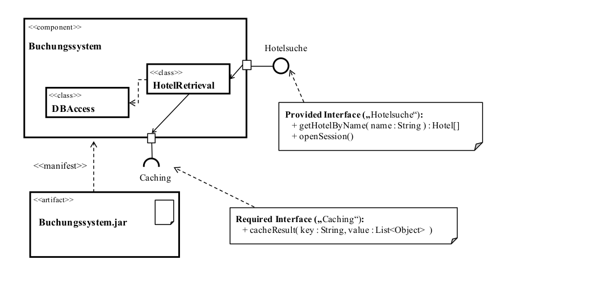
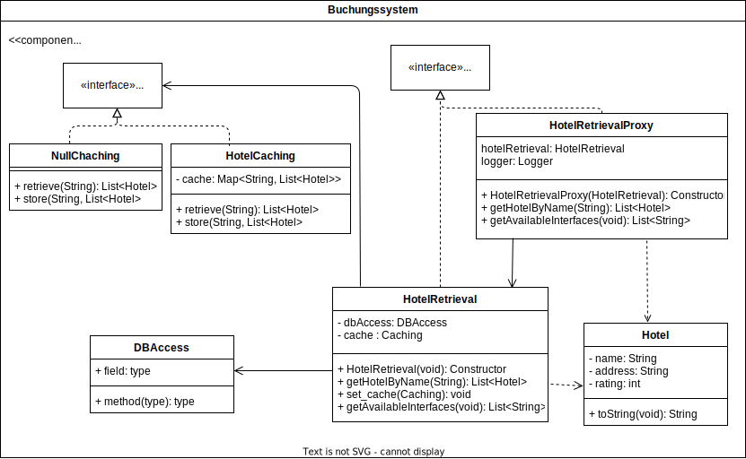

# OOKA - Proxy Pattern

## Tasks:

Given the following Model, implement a port concept:

0. Port Concept implemented via Proxy Pattern.
- Hotelsuche-Interface
- HotelRetrieval-Class
- HotelRetrievalProxy-Class

1. Created a Hotel-Class
2. Added Caching interface and Class
3. Added default Caching class which returns Null
    - HotelRetrieval still has to check if the return value is `null`.
    - Alternatively Caching could call DBAccess which feels wrong.
    - Other solutions...?
4. Added Logging functionality to Proxy-Class
5. Created executable .jar file
    - Included dependencies (postgresql) via maven-shade-plugin into the same jar-file.
    - when to use maven-shade vs assembly?
6. Included get_interfaces()-Method

## Class diagram

## Missing

- Caching is not implemented as an external component. Instead inside the component itself.
- Dont know yet how to access the .jar-files interfaces. (Currently just printing the available interfaces via main-method.)